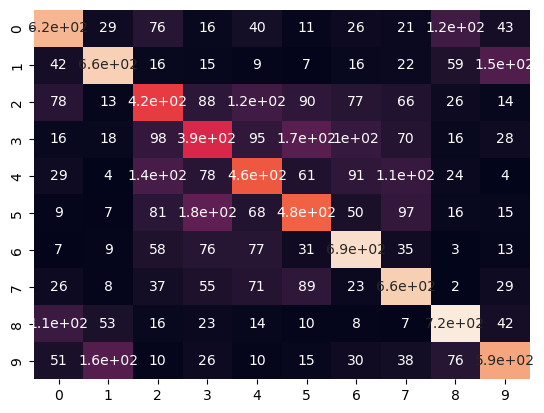
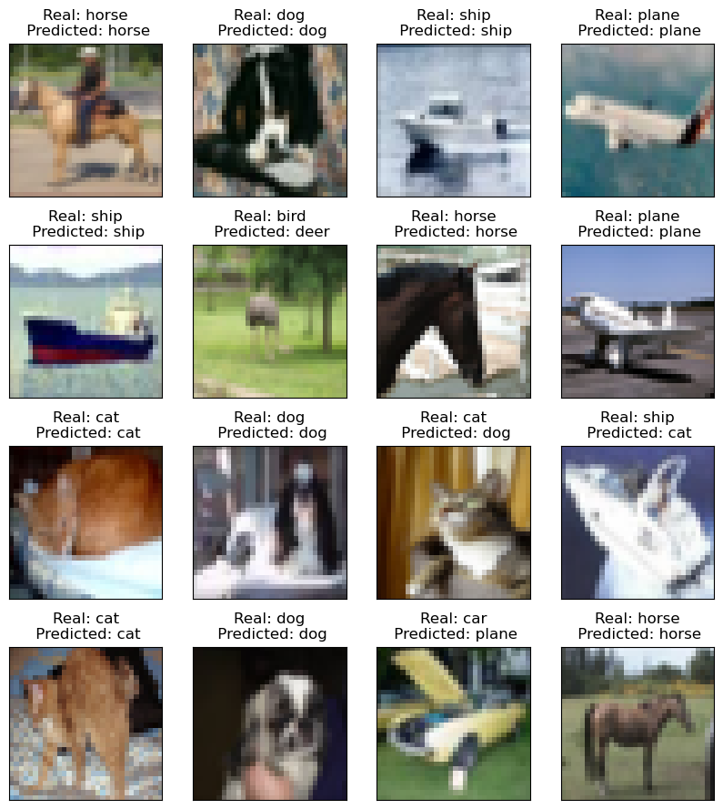

# Лабораторная работа номер 1
## Выполнил Георгий Бех

Решается задача классификации. Датасет - CIFAR-10

Классы:

| class | label |
|-------|---|
| plane | 0 |
| car   | 1 |
| bird  | 2 |
| cat   | 3 |
| deer  | 4 |
| dog   | 5 |
| frog  | 6 |
| horse | 7 |
| ship  | 8 |
| truck | 9 |

Цель - ускорить достижение метрик.
Метод - выбрать оптимизатор.

Эксперимент 1:
Архитектура - ResNet-18
Loss - CrossEntropy
Оптимизатор - SGD
lr - 0.001
Число эпох - 10

Результаты:

|  Class name |  Accuracy | Precision |  Recall | f1_score |
|---|---|---|---|---|
| plane | 0.822  | 0.75343721 |  0.822 | 0.78622669 |
|  car   |  0.869 | 0.81290926 | 0.869 | 0.84001933 |
|  bird   |  0.59 | 0.70658683 |  0.59 | 0.64305177 |
|  cat   |  0.569 |  0.57825203 |  0.569  | 0.57358871 |
|  deer   |  0.721 | 0.67007435 |   0.721  | 0.69460501 |
|  dog   |  0.587 |  0.64082969 |   0.587  | 0.61273486 |
|  frog   |  0.737 |  0.84518349 |   0.737  | 0.78739316 |
|  horse   | 0.865 | 0.69422151 |   0.865  | 0.77025824 |
|  ship   |  0.837 |  0.86111111|   0.837  | 0.84888438 |
|  truck   | 0.786 |  0.8370607 |   0.786  | 0.81072718 |

Матрица запутанности:

Эксперимент 2:
Архитектура - ResNet-18
Loss - CrossEntropy
Оптимизатор - Adam
lr - 0.001
Число эпох - 6

Результаты:

|  Class name |  Accuracy | Precision |  Recall | f1_score |
|---|---|---|---|---|
| plane | 0.854  | 0.70753935 |  0.854 | 0.77390122 |
|  car   |  0.832 | 0.87671233 | 0.832 | 0.85377116 |
|  bird   | 0.635 | 0.69323144 | 0.635 | 0.66283925 |
|  cat   |  0.515 | 0.5819209 |  0.515  | 0.5464191 |
|  deer   |  0.722 | 0.71343874 |   0.722  | 0.71769384 |
|  dog   |  0.728 |  0.57594937 |   0.728  | 0.64310954 |
|  frog   |  0.789 |  0.81761658 |   0.789  | 0.80305344 |
|  horse   | 0.735 | 0.87085308 |  0.735  | 0.79718004 |
|  ship   | 0.815 |  0.87728741 |  0.815  | 0.84499741 |
|  truck   | 0.837 |  0.81341108 |  0.837  | 0.82503696 |

Матрица запутанности:

Loss на обучающей выборке:

Loss на валидации:

Результаты на тестовой выборке на 16 картинках:

Выводы

Результаты лабораторной работы повторяют наблюдения в реальной разработке - 
Adam при прочих равных сходится к таким же метрикам быстрее SGD на 30% что существенно
при разработке. По этому лучше фиксировать проверенный временем оптимизатор и фокусироваться
на прочих гиперпараметрах.

